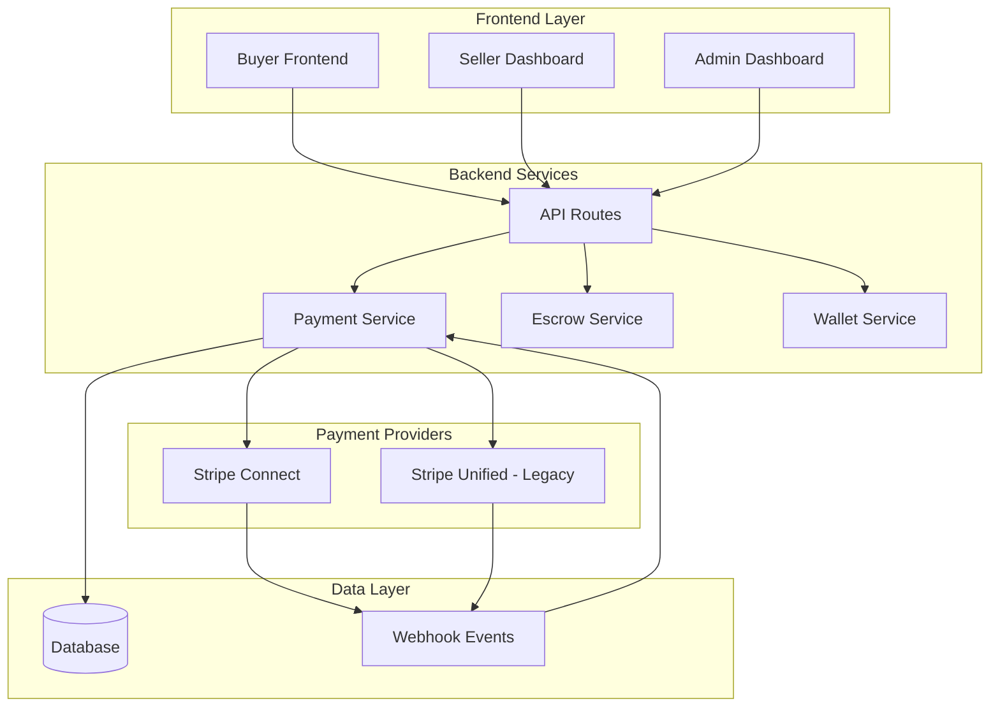
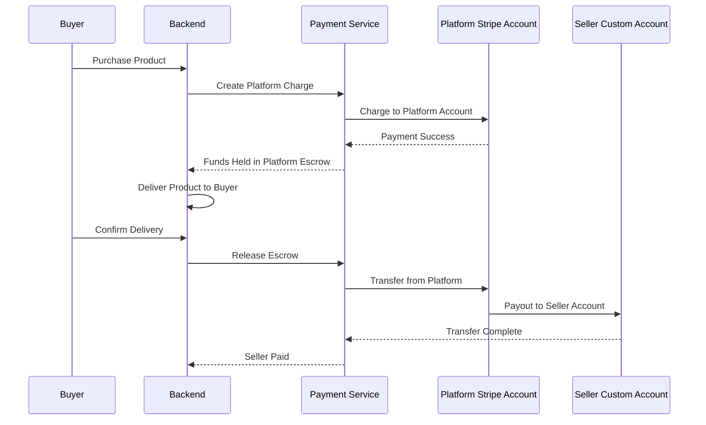

# Design Document

## Overview

The Stripe Connect migration transforms the payment architecture from a unified Stripe account model to a platform-based Connect model with custom accounts. This design implements proper escrow handling, seller onboarding, and maintains backward compatibility while preparing for future payment method integrations.

## Architecture

### High-Level Architecture



### Payment Flow Architecture



## Components and Interfaces

### Payment Service Adapter

**Location:** `/backend/src/services/payment/stripeAdapter.ts`

**Interface:**
```typescript
interface PaymentAdapter {
  // Account Management
  createStripeAccountForSeller(sellerId: string): Promise<StripeAccount>
  createAccountLink(accountId: string): Promise<string>
  
  // Payment Processing
  createPaymentIntentOnPlatform(amount: number, metadata: object): Promise<PaymentIntent>
  createTopUpIntent(buyerId: string, amount: number): Promise<PaymentIntent>
  createTransferToSeller(escrowId: string, amount: number, sellerId: string): Promise<Transfer>
  
  // Refunds and Disputes
  refundPayment(paymentIntentId: string, amount?: number): Promise<Refund>
  
  // Webhook Processing
  handleWebhookEvent(event: StripeEvent): Promise<NormalizedEvent>
}
```

### Legacy Wallet Bridge

**Location:** `/backend/src/services/payment/legacyWalletBridge.ts`

**Purpose:** Maintains compatibility with existing wallet balances during migration.

**Interface:**
```typescript
interface LegacyWalletBridge {
  getLegacyBalance(userId: string): Promise<number>
  spendLegacyBalance(userId: string, amount: number): Promise<boolean>
  refundToLegacyWallet(userId: string, amount: number): Promise<void>
  migrateLegacyWallet(userId: string): Promise<void>
}
```

### Webhook Handler

**Location:** `/backend/src/routes/webhooks/stripe.ts`

**Responsibilities:**
- Process both Connect and legacy webhook events
- Store raw events for audit
- Create normalized event mappings
- Trigger appropriate business logic

### Reconciliation Service

**Location:** `/backend/src/jobs/reconcileStripe.ts`

**Functions:**
- Compare Stripe platform balance with database records
- Verify transfer amounts against seller balances
- Identify discrepancies for manual review
- Generate reconciliation reports

## Data Models

### New Collections

#### stripe_accounts
```typescript
interface StripeAccount {
  _id: ObjectId
  seller_id: ObjectId
  stripe_account_id: string
  status: 'pending' | 'verified' | 'restricted' | 'rejected'
  capabilities: string[]
  created_at: Date
  updated_at: Date
}
```

#### payment_operations
```typescript
interface PaymentOperation {
  _id: ObjectId
  type: 'charge' | 'transfer' | 'refund' | 'topup'
  stripe_id: string
  amount_cents: number
  currency: string
  status: 'pending' | 'succeeded' | 'failed'
  metadata: object
  idempotency_key: string
  created_at: Date
  updated_at: Date
}
```

#### webhook_events
```typescript
interface WebhookEvent {
  _id: ObjectId
  stripe_event_id: string
  type: string
  raw_data: object
  processed: boolean
  processed_at?: Date
  created_at: Date
}
```

#### legacy_wallets
```typescript
interface LegacyWallet {
  _id: ObjectId
  user_id: ObjectId
  balance_cents: number
  source: 'unified_stripe_dev'
  migrated: boolean
  created_at: Date
  updated_at: Date
}
```

### Modified Collections

#### escrows
```typescript
interface Escrow {
  // ... existing fields
  funding_source: 'legacy_wallet' | 'platform_pi'
  funding_reference: string // pi_id or legacy_tx_id
  stripe_transfer_id?: string
}
```

#### wallets
```typescript
interface Wallet {
  // ... existing fields
  source: 'legacy' | 'platform_payment'
  legacy_balance_cents?: number
}
```

## Error Handling

### Payment Failures
- Implement retry logic with exponential backoff
- Store failed operations for manual review
- Provide clear error messages to users
- Log all payment errors with context

### Webhook Processing
- Handle duplicate webhook events idempotently
- Implement dead letter queue for failed webhook processing
- Provide webhook replay functionality
- Monitor webhook processing latency

### Account Verification Issues
- Handle incomplete KYC verification gracefully
- Provide clear guidance for sellers on verification requirements
- Implement notification system for verification status changes
- Support manual review process for edge cases

### Migration Errors
- Validate data integrity before and after migration steps
- Implement rollback procedures for failed migrations
- Provide detailed migration logs
- Support partial migration recovery

## Testing Strategy

### Unit Tests
- Payment adapter methods with mocked Stripe responses
- Legacy wallet bridge functionality
- Webhook event processing logic
- Data model validation and transformations

### Integration Tests
- End-to-end payment flows with Stripe test environment
- Webhook event handling with simulated Stripe events
- Database operations and data consistency
- Feature flag toggling between legacy and new flows

### Migration Tests
- Legacy data migration scripts with test datasets
- Backward compatibility verification
- Data integrity validation
- Performance impact assessment

### Load Tests
- Payment processing under high volume
- Webhook processing capacity
- Database performance with new schema
- Concurrent payment operations

## Security Considerations

### API Security
- Validate all webhook signatures
- Implement rate limiting on payment endpoints
- Use secure idempotency keys
- Encrypt sensitive payment data

### Data Protection
- Mask sensitive payment information in logs
- Implement proper access controls for payment data
- Ensure PCI compliance for stored payment references
- Regular security audits of payment flows

### Account Security
- Validate seller account ownership
- Implement fraud detection for unusual payment patterns
- Monitor for suspicious account creation
- Secure storage of Stripe account credentials

## Configuration Management

### Environment Variables
```
STRIPE_SECRET_KEY=sk_test_...
STRIPE_CONNECT_MODE=test|live
STRIPE_WEBHOOK_SECRET=whsec_...
FEATURE_USE_LEGACY_WALLET=true|false
FEATURE_LEGACY_WALLET_READONLY=true|false
```

### Feature Flags
- `FEATURE_USE_LEGACY_WALLET`: Toggle legacy wallet functionality
- `FEATURE_LEGACY_WALLET_READONLY`: Prevent new legacy wallet topups
- `FEATURE_STRIPE_CONNECT_ENABLED`: Enable new Connect flows
- `FEATURE_AUTO_SELLER_MIGRATION`: Automatically migrate eligible sellers

## Migration Strategy

### Phase 1: Infrastructure Setup
- Deploy payment service adapter
- Set up webhook handlers
- Create new database collections
- Implement feature flags

### Phase 2: Data Migration
- Migrate existing wallet balances to legacy_wallets
- Update existing escrow records with funding source information
- Create seller migration tracking
- Validate data integrity

### Phase 3: New Flow Implementation
- Enable new wallet topup flows
- Implement seller onboarding
- Deploy new checkout process
- Test end-to-end flows

### Phase 4: Legacy Deprecation
- Disable legacy wallet topups
- Migrate remaining sellers
- Remove legacy code paths
- Complete reconciliation

## Monitoring and Observability

### Metrics
- Payment success/failure rates
- Webhook processing latency
- Migration progress tracking
- Reconciliation discrepancies

### Alerts
- Failed payment operations
- Webhook processing failures
- Data consistency issues
- High error rates in payment flows

### Logging
- Structured logging for all payment operations
- Correlation IDs for tracing payment flows
- Audit logs for administrative actions
- Performance metrics for critical paths